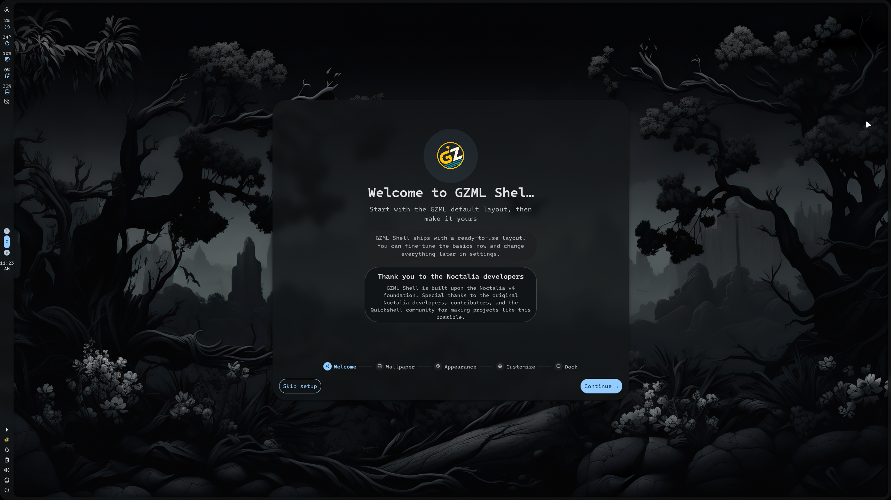
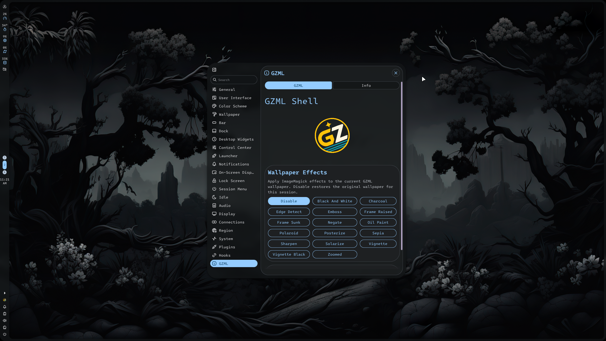

# GZML Shell -v0.6.6 is Now Live -now with NixOS support!
Run your gzml-shell-update command to get the latest version!(it will not overwrite user configs)

GZML Shell is a standalone desktop shell built with Quickshell, designed to provide a modern, customizable,  desktop experience while maintaining a clear separation between shell components and user configuration.

Unlike traditional dotfile collections or configuration overlays, GZML Shell is packaged as its own shell environment. Updates are designed to preserve user configuration, allowing the shell itself to evolve independently from personal settings, profiles, themes, and customizations. The  project focuses on flexibility, long-term maintainability, and user ownership of configuration while providing an approachable first run experience for new users.

The GZML Shell is a fork and continuation of the Noctalia V4 Quickshell based experience. This project would not exist without the incredible work of the Noctalia developers and contributors. Full credit goes to the original Noctalia team for creating the foundation upon which GZML Shell is built.

While GZML Shell originated from the Noctalia V4 codebase, it is now maintained as an independent project with its own goals, architecture, features, and development roadmap. GZML Shell is not affiliated with, endorsed by, or maintained by the original Noctalia developers, and they are not responsible for the support, maintenance, or development of this fork.

The goal of GZML Shell is to provide a feature rich, Quickshell based desktop experience while maintaining compatibility with existing user workflows and offering a straightforward migration path for users who wish to continue using a V4-style environment. 

## Installation
## Dependencies

### Arch Linux (Recommended)

Current development and testing primarily targets Arch-based distributions, with additional expirmental installer support for Fedora, Debian/Ubuntu, and openSUSE families.

For Arch-based users the installer will automatically check for required dependencies and, with your permission, attempt to install any missing packages using your system package manager.

Required packages include:

```bash
quickshell
qt6-declarative
qt6-svg
qt6-multimedia
qt6-5compat
jq
rsync
git
python
wl-clipboard
grim
slurp
swappy
brightnessctl
pamixer
playerctl
networkmanager
bluez
bluez-utils
pavucontrol
matugen
adw-gtk-theme
```

---

### Fedora (Experimental)

Please install the required dependencies manually before running the installer.

```bash
sudo dnf install \
  quickshell \
  git \
  rsync \
  jq \
  python3 \
  wl-clipboard \
  grim \
  slurp \
  swappy \
  brightnessctl \
  playerctl \
  NetworkManager \
  bluez \
  bluez-tools \
  pavucontrol \
  qt6-qtdeclarative \
  qt6-qtsvg \
  qt6-qtmultimedia \
  adw-gtk3-theme
```

> Note: Depending on your Fedora version, Quickshell may require enabling a COPR repository or manual installation.

---

### Debian / Ubuntu (Experimental)

Please install the required dependencies manually before running the installer.

```bash
sudo apt install \
  git \
  rsync \
  jq \
  python3 \
  wl-clipboard \
  brightnessctl \
  playerctl \
  network-manager \
  bluez \
  pavucontrol \
  qml6-module-qtquick \
  qml6-module-qtquick-controls \
  qml6-module-qtmultimedia  \
  adw-gtk-theme distro equivelent
```

> Note: Quickshell is not currently available in many Debian/Ubuntu repositories and may need to be built or installed manually.

---

### openSUSE (Experimental)

Please install the required dependencies manually before running the installer.

```bash
sudo zypper install \
  quickshell \
  git \
  rsync \
  jq \
  python3 \
  wl-clipboard \
  grim \
  slurp \
  swappy \
  brightnessctl \
  playerctl \
  NetworkManager \
  bluez \
  pavucontrol \
  qt6-declarative \
  qt6-svg \
  qt6-multimedia \
  adw-gtk-theme distro equivelent
```

> Note: Package names may vary slightly between openSUSE releases.

If a dependency is unavailable in your distribution's repositories, please consult your distribution's documentation or install the equivalent package manually before running the installer or open up a support ticket here on the repo.

```bash
git clone https://github.com/zero-j89/gzml_shell.git
cd gzml_shell
```
Then run:
```bash
bash ./install.sh
```
To update the repo simply run:
```bash
gzml-shell-update
```
The updater will:

- Pull the latest changes from the original GZML Shell source repository
- Re-run the installer
- Preserve your existing user configuration
  
##

The installer checks for required dependencies, asks before installing missing packages, installs the shell source, creates the initial user configuration when needed, and preserves existing user settings during future updates.

## Profiles

GZML Shell includes a built in profile system that allows users to maintain multiple independent shell configurations.

Profiles are user created and user-managed. The project intentionally ships with a clean default experience rather than preloaded personal profiles.

## Plugins

GZML Shell supports optional plugins and modular functionality, including compatibility with Noctalia v4 plugins.

Only the plugins required by the factory default configuration are enabled by default. Additional plugins remain available for users who wish to extend functionality without forcing unnecessary components into every installation.

##
## Migrating from Noctalia (Optional)

GZML Shell includes a built in migration utility for users coming from Noctalia.

The migration tool can import:

* Profiles
* Color schemes
* Colors
* Notification rules
* User templates
* Compatible plugin settings
* Compatible shell settings

The migration process automatically sanitizes imported settings and converts known Noctalia specific paths and IPC references to their GZML Shell equivalents where applicable.

Your original Noctalia configuration is never modified and remains available as a fallback.

### Preview Migration

Note*** It is mot mandatory to close gzml-shell before running the migrator the settings will be applied live.

To preview all changes without modifying any files:

```bash
gzml-shell-migrate --dry-run
```

### Run Migration

To Import your existing Noctalia configuration:
```bash
gzml-shell-migrate
```
Keep your .config/noctalia folder in the same location for addtional/user plugin support untill furthur notice.

To launch gzml-shell without a terminal (without relying on startup):
```bash
setsid -f gzml-shell >/dev/null 2>&1
```


### Notes

* Existing GZML Shell configurations are automatically backed up before migration.
* Unsupported or unknown plugin configurations may be disabled for compatibility.
* Plugin settings that rely on Noctalia specific IPC behavior may require manual adjustment.
* Your original `~/.config/noctalia` configuration is preserved and can still be used independently of GZML Shell.

Migration is completely optional. GZML Shell can always be used as a fresh installation without importing any previous configuration.


## IPC Commands

GZML Shell exposes functionality through Quickshell IPC, allowing integration with keybinds, scripts, launchers, automation tools, and external applications.

### Profile Switcher

```bash
qs -p ~/.config/quickshell-gzml ipc call plugin:shell-profiles toggleProfiles
```

### Wallpaper Selector

```bash
qs ipc -p ~/.config/quickshell-gzml call wallpaper toggle
```
or for wallcards
```bash
qs -p /home/zer0/.config/quickshell-noctalia ipc call plugin:wallcards toggle
```

### IPC Discovery

```bash
qs ipc -p ~/.config/quickshell-gzml show
```

or, depending on the installed Quickshell version:

```bash
qs ipc list
```

Additional IPC endpoints will be documented as the API stabilizes.

## Automatic Startup

To launch GZML Shell automatically, add the launch command to your compositor or session startup configuration:

```bash
gzml-shell
```

For Hyprland Lua configurations:

```lua
hl.exec_once("gzml-shell")
```

Or if in StarupApps:

```ini
run("gzml-shell")
```

Equivalent startup methods can be used with other compositors.

## About

GZML-Shell is built on the original Noctalia V4 Quickshell engine. It delivers all of Noctalia’s signature customization features while introducing extra quality of life tools and long overdue bug fixes. As Noctalia transitions to its new C++ V5 architecture, many community members will miss the classic V4 Quickshell experience. This project was born out of a desire to keep that beloved environment alive, fully supported, and enhanced for a broader audience. What began as a private, independent test environment originally built to teach my growing nephew the ropes of Linux and electronics has evolved into a feature rich, out of the box alternative to stock Noctalia. We have an exciting roadmap ahead, including options for an extra customizable taskbar, and we are fully committed to long term community support.

## Credits

GZML Shell would not exist without the work of the Quickshell project, the Noctalia developers, and the many open-source contributors whose work continues to make projects like this possible.
